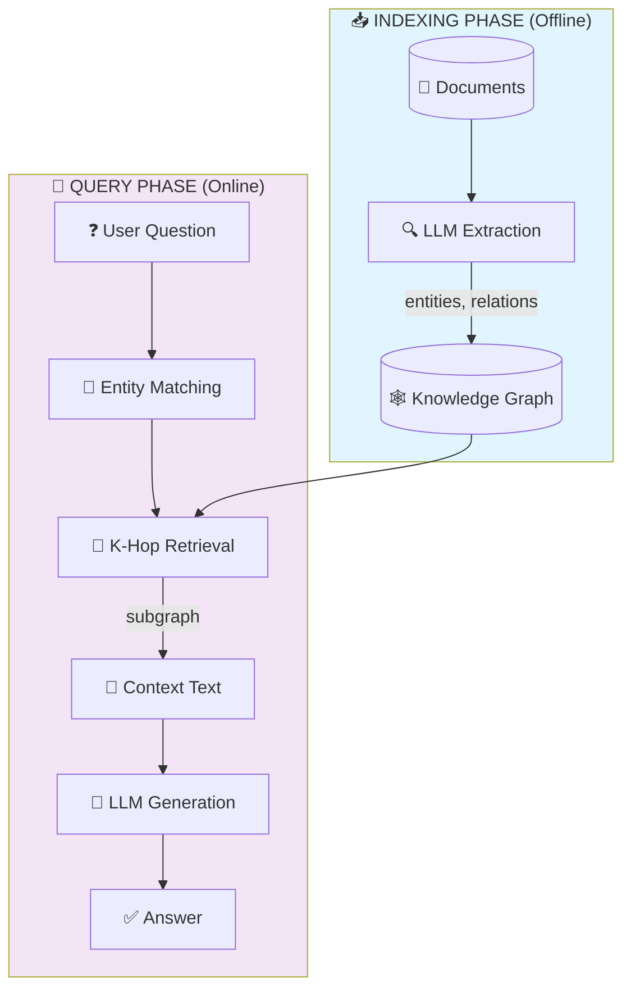
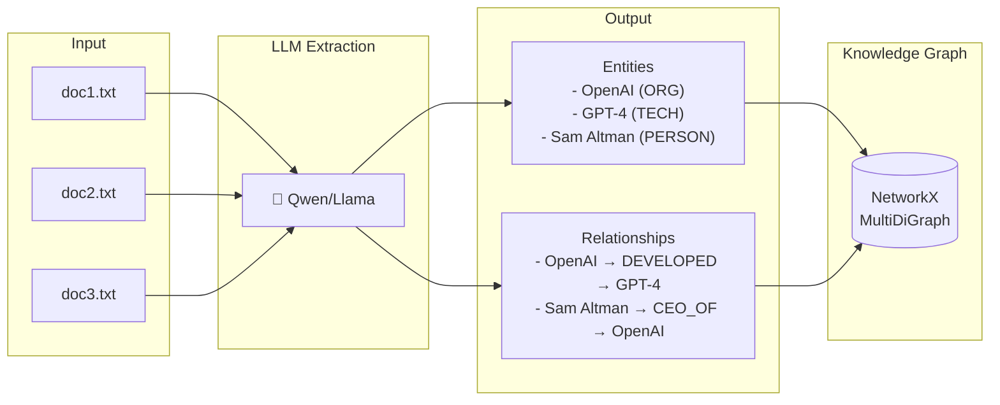
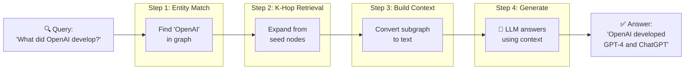
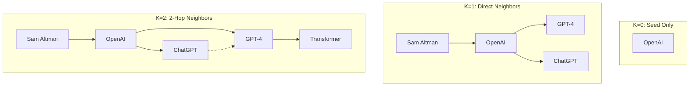
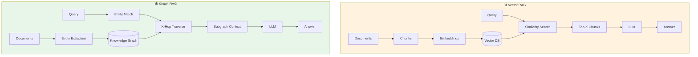
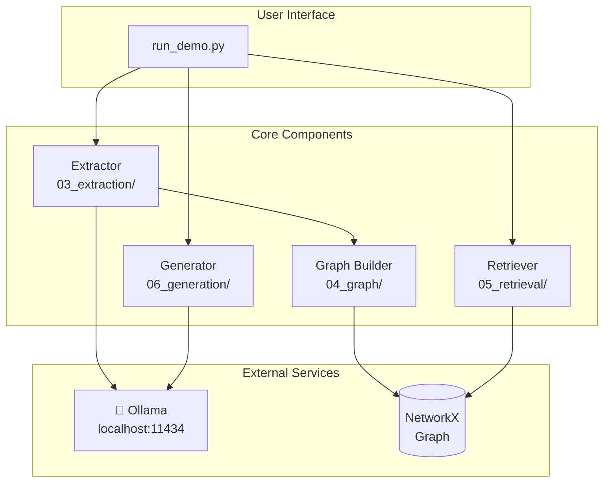
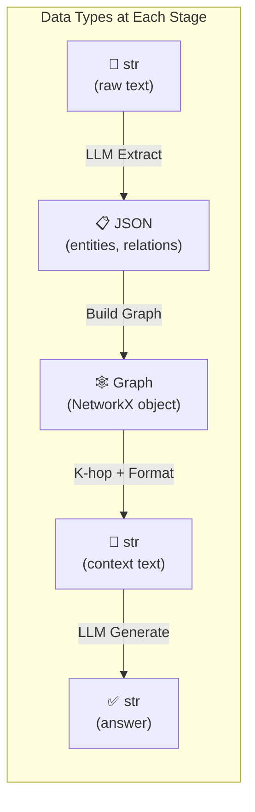
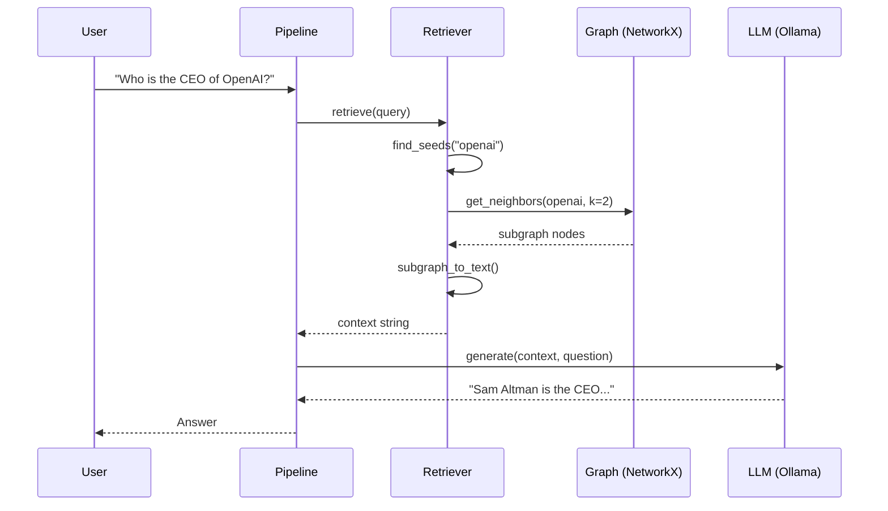
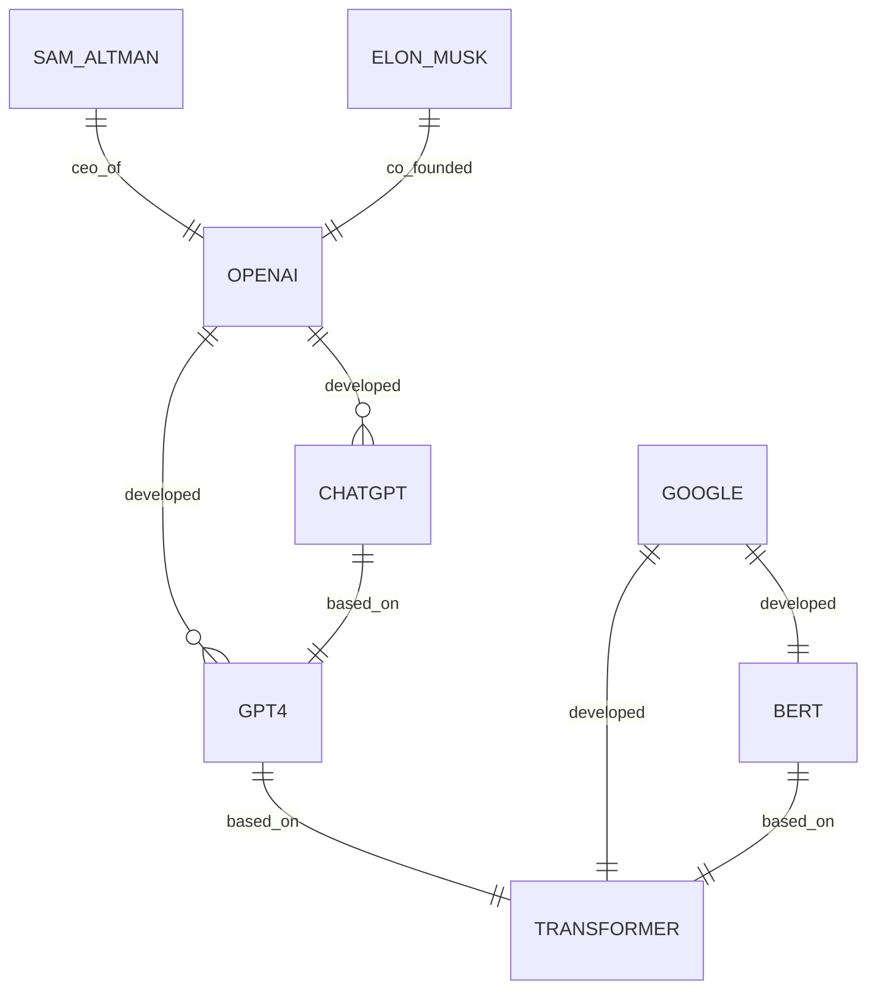
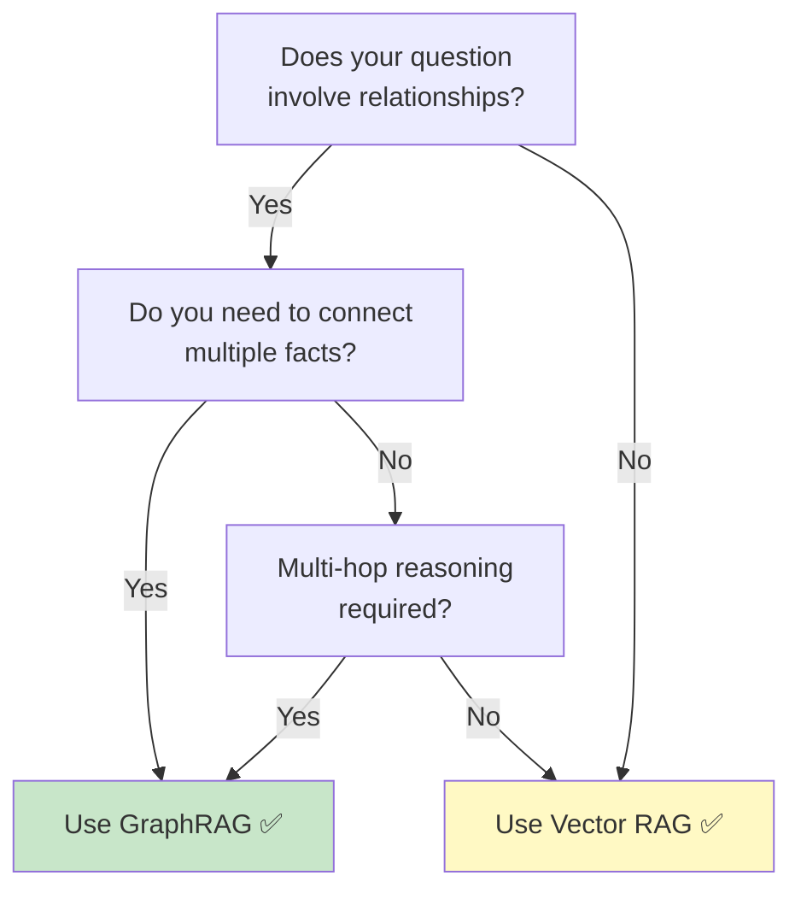

# GraphRAG Mermaid Diagrams

These diagrams can be rendered in GitHub, VS Code (with Mermaid extension), Notion, or https://mermaid.live

---

## 1. Overall Pipeline Flow



---

## 2. Indexing Pipeline Detail



---

## 3. Query Pipeline Detail



---

## 4. K-Hop Expansion Visualization



---

## 5. Vector RAG vs Graph RAG



---

## 6. Component Architecture



---

## 7. Data Transformation Flow



---

## 8. Sequence Diagram: Query Processing



---

## 9. Entity-Relationship Example



---

## 10. Decision Flow: When to Use GraphRAG



---

## How to Render These Diagrams

1. **GitHub**: Just paste the markdown - GitHub renders Mermaid natively

2. **VS Code**: Install "Markdown Preview Mermaid Support" extension

3. **Online**: Paste code blocks at https://mermaid.live

4. **Export**: Use mermaid-cli to export as PNG/SVG:
   ```bash
   npm install -g @mermaid-js/mermaid-cli
   mmdc -i mermaid_diagrams.md -o output.png
   ```
