# GraphRAG Workflow - Mermaid Diagrams

> These diagrams can be rendered on GitHub, VS Code (with Mermaid extension), or https://mermaid.live

---

## 1. High-Level System Architecture

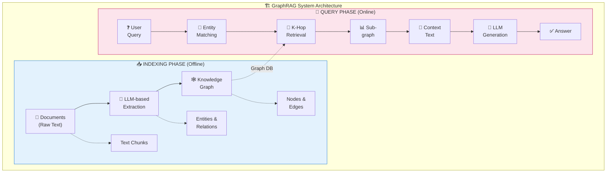

---

## 2. Detailed Indexing Pipeline

```mermaid
flowchart LR
    subgraph Step1["Step 1.1: Document Ingestion"]
        doc1["📄 doc1.txt"]
        doc2["📄 doc2.txt"]
        doc3["📄 doc3.txt"]
        loader["📂 Text Loader<br/>(UTF-8)"]
        raw["📋 Raw Text<br/>Collection"]

        doc1 --> loader
        doc2 --> loader
        doc3 --> loader
        loader --> raw
    end

    subgraph Step2["Step 1.2: Entity Extraction"]
        rawtext["📋 Raw Text"]
        llm["🤖 LLM + Prompt<br/>(Extraction)"]
        json["📊 Structured<br/>JSON Output"]

        rawtext --> llm --> json
    end

    subgraph Step3["Step 1.3: Graph Construction"]
        struct["📊 JSON<br/>Extractions"]
        graph["🕸️ NetworkX Graph"]

        struct --> graph
    end

    raw --> rawtext
    json --> struct

    style Step1 fill:#fff9c4
    style Step2 fill:#f3e5f5
    style Step3 fill:#e8f5e9
```

---

## 3. Entity Extraction Detail

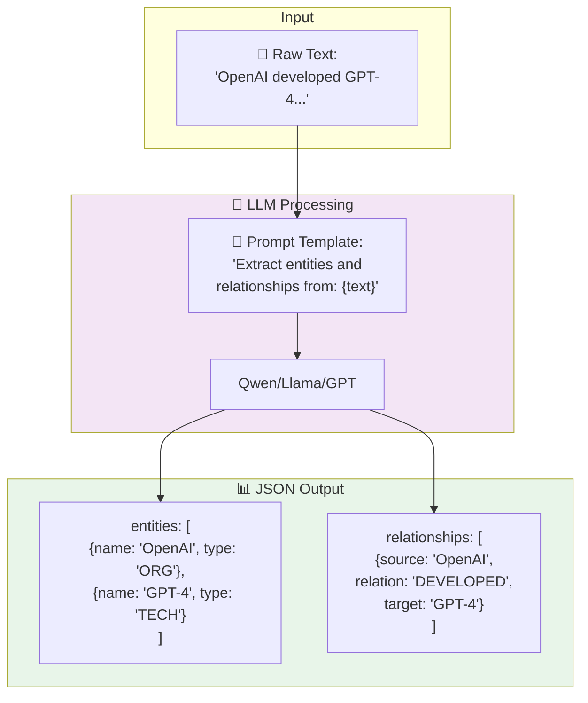

---

## 4. Knowledge Graph Structure

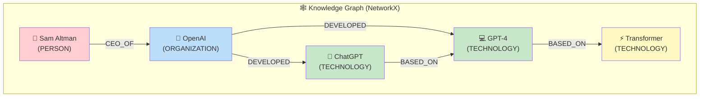

---

## 5. Query Pipeline - Step by Step

```mermaid
flowchart LR
    subgraph S1["Step 2.1"]
        Q["❓ User Query:<br/>'What did OpenAI develop?'"]
        EM["🎯 Entity Matching<br/>Find 'OpenAI' in graph"]
        Seeds["🌱 Seeds: [openai]"]
        Q --> EM --> Seeds
    end

    subgraph S2["Step 2.2"]
        KHop["🔗 K-Hop Retrieval<br/>Expand k=2 hops"]
        Sub["📊 Subgraph"]
        Seeds2["🌱 Seeds"]
        Seeds2 --> KHop --> Sub
    end

    subgraph S3["Step 2.3"]
        Sub2["📊 Subgraph"]
        Convert["⚙️ Convert to Text"]
        Context["📝 Context:<br/>'Entities: OpenAI, GPT-4...<br/>Relations: DEVELOPED...'"]
        Sub2 --> Convert --> Context
    end

    subgraph S4["Step 2.4"]
        Context2["📝 Context + Question"]
        LLM["🤖 LLM Generation"]
        Answer["✅ Answer:<br/>'OpenAI developed<br/>GPT-4 and ChatGPT'"]
        Context2 --> LLM --> Answer
    end

    Seeds --> Seeds2
    Sub --> Sub2
    Context --> Context2

    style S1 fill:#e1f5fe
    style S2 fill:#fff3e0
    style S3 fill:#f5f5f5
    style S4 fill:#e8f5e9
```

---

## 6. K-Hop Retrieval Visualization

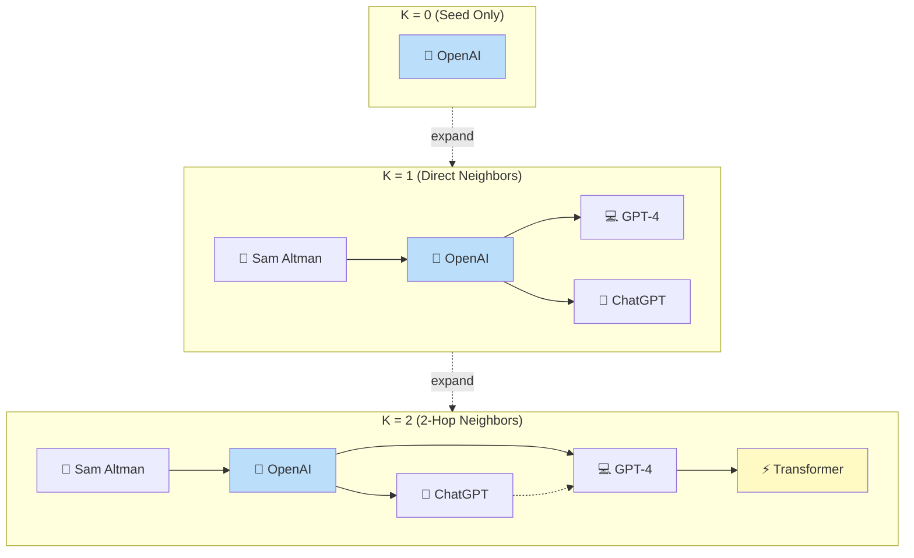

---

## 7. Vector RAG vs Graph RAG Comparison

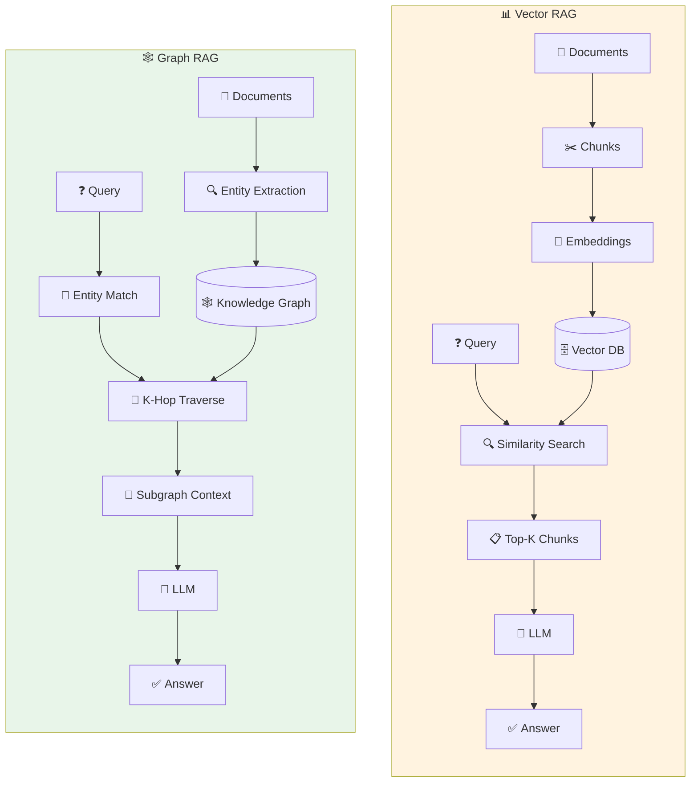

---

## 8. Multi-Hop Reasoning Example

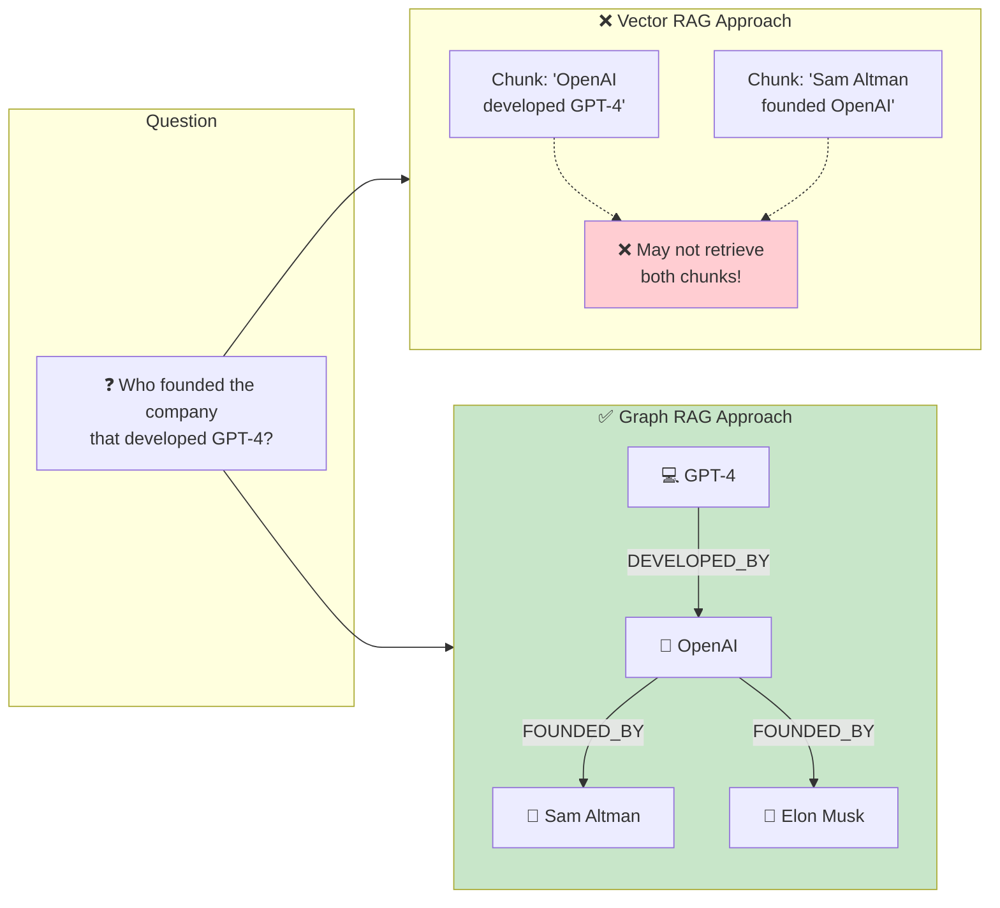

---

## 9. Component Interaction

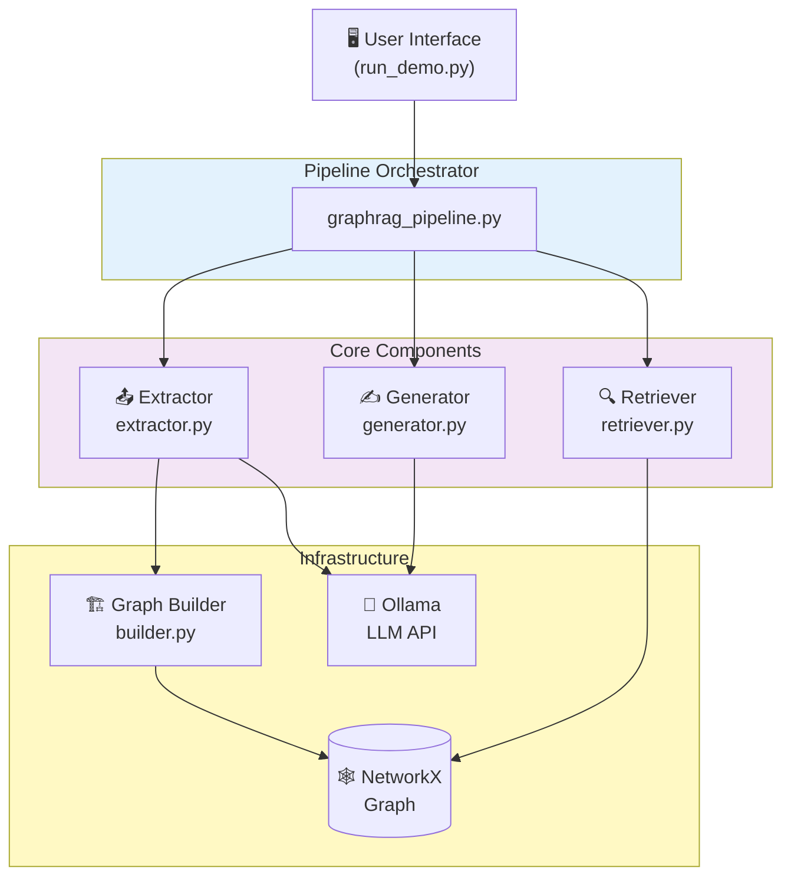

---

## 10. Data Flow Diagram

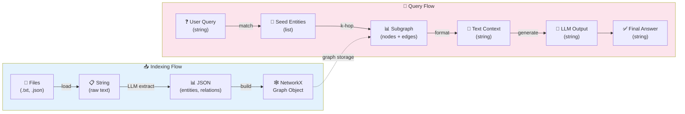

---

## 11. LLM Call Points

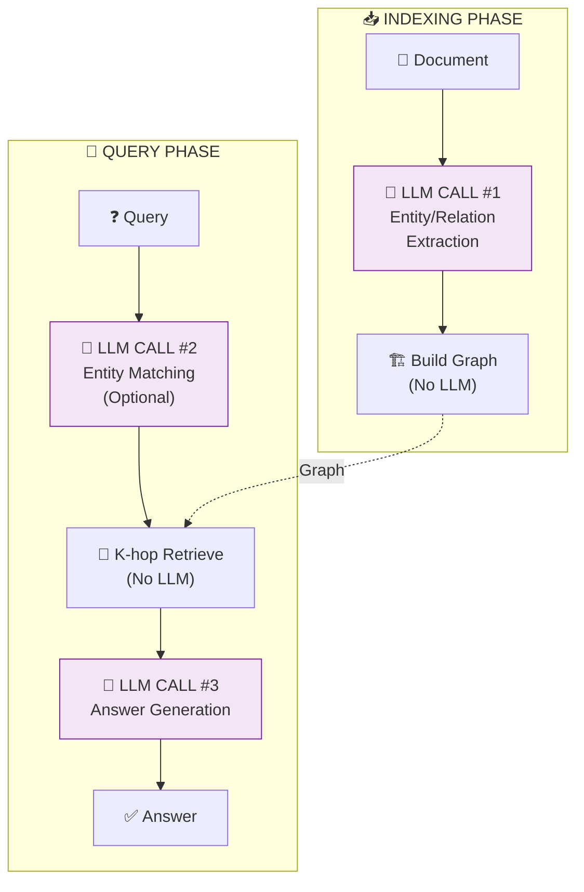

---

## 12. Complete End-to-End Workflow

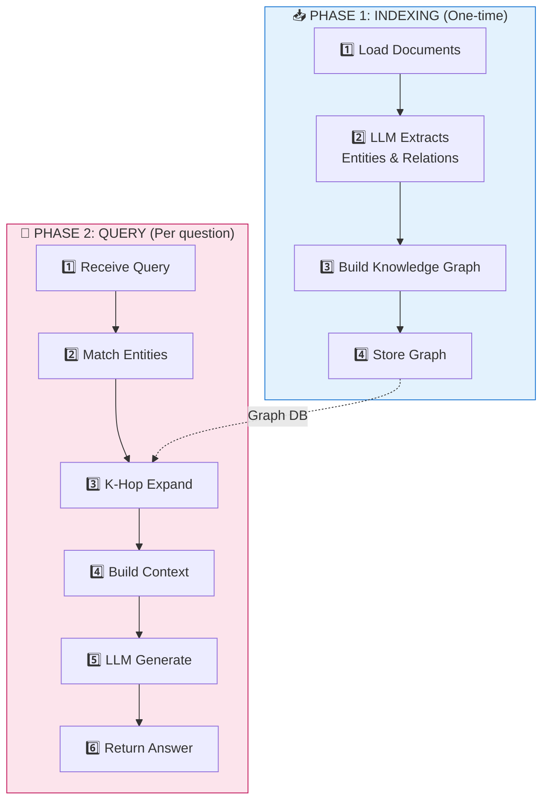

---

## 13. Entity-Relationship Diagram (Sample Graph)

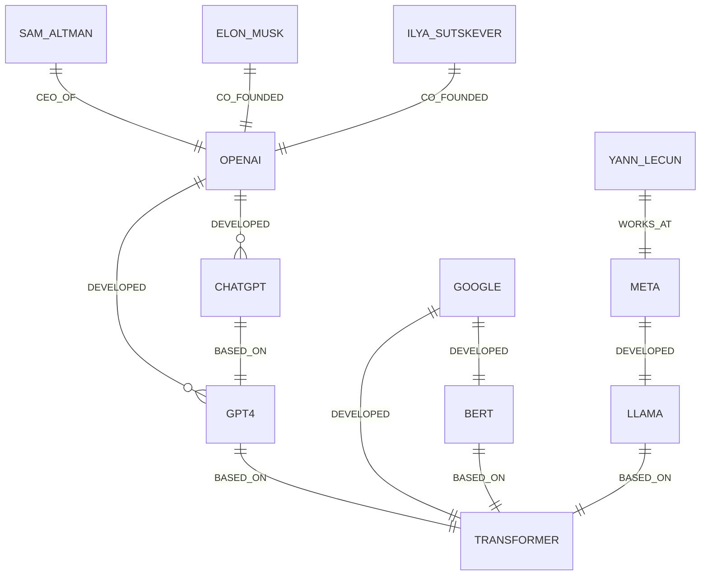

---

## 14. Sequence Diagram: Query Processing

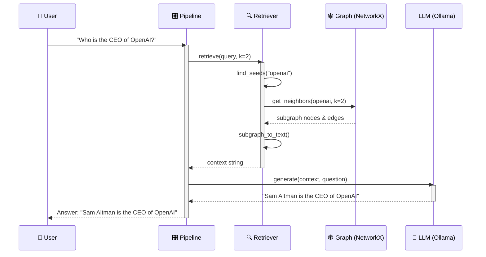

---

## 15. Decision Flowchart: When to Use GraphRAG

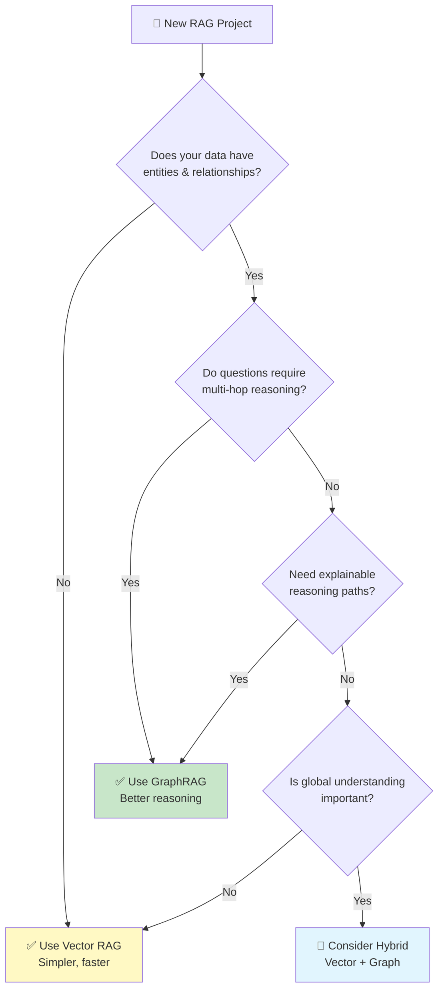

---

## How to Use These Diagrams

### GitHub
Just view this file on GitHub - diagrams render automatically.

### VS Code
1. Install extension: **Markdown Preview Mermaid Support**
2. Open this file
3. Press `Cmd+Shift+V` (Mac) or `Ctrl+Shift+V` (Windows) to preview

### Export to Images
1. Go to https://mermaid.live
2. Paste any diagram code block
3. Download as PNG/SVG

### In Presentations
- Use screenshots from mermaid.live
- Or embed in tools that support Mermaid (Notion, Obsidian, etc.)
